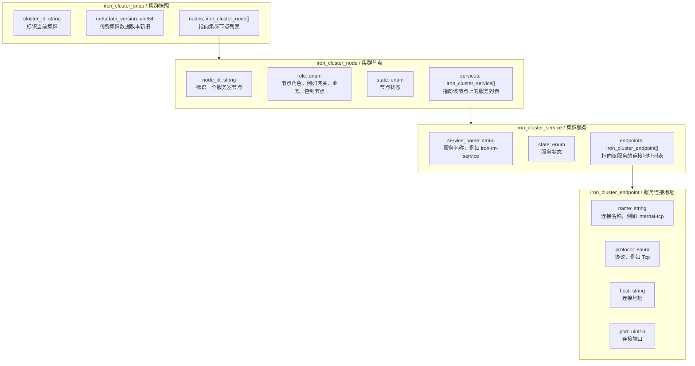

# IronMesh Cluster Base Protocol

This document describes the minimal cluster data model for IronMesh.

The FlatBuffers schema is the source of truth for the cluster protocol:

- `iron-protocol/iron-flat-dsl/cluster/cluster.fbs`

The Rust crate `iron-protocol/iron-scheme-libs/iron-scheme-cluster` generates Rust bindings from that schema during build.

The first version intentionally keeps the model small. It only answers these questions:

- Which cluster is this?
- Which server nodes are in the cluster?
- Which services are running on each node?
- How can each service be connected?

## Minimal Data Structures



## FlatBuffers DSL

The cluster protocol uses one FlatBuffers schema file in the first version:

```text
iron-protocol/iron-flat-dsl/cluster/cluster.fbs
```

Naming rules:

- table and enum names use `PascalCase`, such as `IronClusterSnap`.
- field names use `snake_case`, such as `cluster_id`.
- the FlatBuffers namespace is `ironmesh.protocol.cluster`.
- `IronClusterSnap` is the root type.

The schema is the protocol authority. When cluster protocol fields change, update `cluster.fbs` first, then update this document and generated Rust bindings.

## Field Relationship

```text
iron_cluster_snap
  ├── cluster_id
  ├── metadata_version
  └── nodes[] --------------------> iron_cluster_node
                                      ├── node_id
                                      ├── role
                                      ├── state
                                      └── services[] ----------> iron_cluster_service
                                                                  ├── service_name
                                                                  ├── state
                                                                  └── endpoints[] ----> iron_cluster_endpoint
                                                                                         ├── name
                                                                                         ├── protocol
                                                                                         ├── host
                                                                                         └── port
```

## Fields

| Data structure | Field | Purpose |
|---|---|---|
| `iron_cluster_snap` | `cluster_id` | 标识当前集群。 |
| `iron_cluster_snap` | `metadata_version` | 判断集群数据版本新旧。 |
| `iron_cluster_snap` | `nodes[]` | 指向集群节点列表。 |
| `iron_cluster_node` | `node_id` | 标识一个服务器节点。 |
| `iron_cluster_node` | `role` | 节点角色，例如网关、业务、控制节点。 |
| `iron_cluster_node` | `state` | 节点状态。 |
| `iron_cluster_node` | `services[]` | 指向该节点上的服务列表。 |
| `iron_cluster_service` | `service_name` | 服务名称，例如 `iron-im-service`。 |
| `iron_cluster_service` | `state` | 服务状态。 |
| `iron_cluster_service` | `endpoints[]` | 指向该服务的连接地址列表。 |
| `iron_cluster_endpoint` | `name` | 连接名称，例如 `internal-tcp`。 |
| `iron_cluster_endpoint` | `protocol` | 协议，例如 `Tcp`。 |
| `iron_cluster_endpoint` | `host` | 连接地址。 |
| `iron_cluster_endpoint` | `port` | 连接端口。 |

## Enums

### `iron_cluster_node_role`

| Value | Meaning |
|---|---|
| `Gateway` | 网关节点。 |
| `Business` | 业务节点。 |
| `Control` | 控制节点。 |

### `iron_cluster_state`

| Value | Meaning |
|---|---|
| `Unknown` | 状态未知。 |
| `Starting` | 启动中。 |
| `Healthy` | 健康。 |
| `Offline` | 离线。 |

### `iron_cluster_endpoint_protocol`

| Value | Meaning |
|---|---|
| `Tcp` | TCP 连接协议。 |
| `Http` | HTTP 连接协议。 |

## Rust Type Mapping

| Protocol data structure | Rust type |
|---|---|
| `iron_cluster_snap` | `IronClusterSnap` |
| `iron_cluster_node` | `IronClusterNode` |
| `iron_cluster_service` | `IronClusterService` |
| `iron_cluster_endpoint` | `IronClusterEndpoint` |
| `iron_cluster_node_role` | `IronClusterNodeRole` |
| `iron_cluster_state` | `IronClusterState` |
| `iron_cluster_endpoint_protocol` | `IronClusterEndpointProtocol` |

## Build Strategy

`iron-scheme-cluster` generates Rust bindings at build time by calling the
project-local FlatBuffers compiler:

- input schema: `iron-protocol/iron-flat-dsl/cluster/cluster.fbs`
- compiler: `iron-protocol/tools/flatc`
- compiler version: locked to `25.12.19`
- output directory: `iron-protocol/iron-scheme-libs/iron-scheme-cluster/src/scheme`
- generated file: `cluster_generated.rs`
- module declaration: `iron-protocol/iron-scheme-libs/iron-scheme-cluster/src/scheme/mod.rs`

The generated Rust file is committed under `src/scheme` because this project
uses a fixed protocol-local compiler. The build script only uses
`iron-protocol/tools/flatc`; it does not read `FLATC` and does not
search system `PATH`. Upgrading FlatBuffers must be a manual project change.

## Fields Intentionally Not Included

The first version does not include these fields:

- `cluster_name`
- `protocol_version`
- `node_name`
- `region`
- `zone`
- `last_seen_at`
- `service_version`
- `weight`
- `metadata`
- `secure`
- `advertise_host`

Add them only after a concrete requirement appears.
